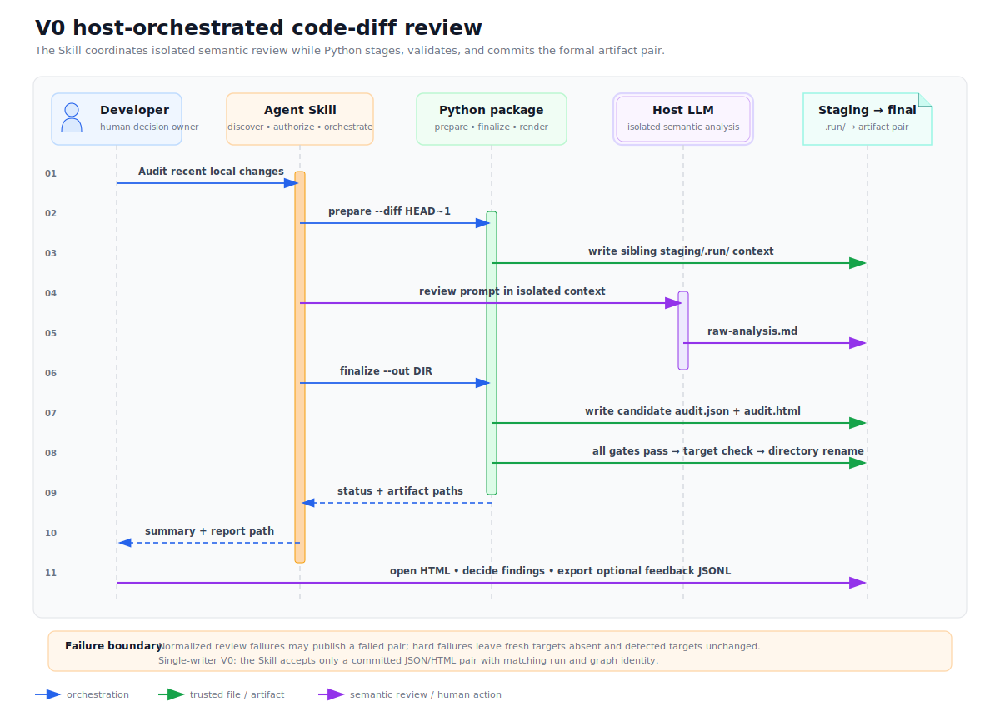

# 本地审计用户链路



PNG 版本：[`change-audit-review-flow.png`](../../../../../docs/assets/change-audit-review-flow.png)

图是辅助视图，下面的文字链路是可检索、可验收的权威契约：

```text
用户发起一次自然语言审计请求
  -> Skill 发现能力、确认输入范围与安装授权
  -> prepare 在最终目录旁创建隐藏 staging
     -> 解析 Git diff、建立可信 hunk index
     -> 生成审计骨架、ReviewPack 与隔离 prompt
  -> Skill 在隔离上下文中调用宿主 LLM
     -> LLM 只产出语义分析，Skill 写入 raw-analysis.md
  -> finalize 在 staging 中 ingest ReviewResult
     -> adapter 生成 ID、edge、fingerprint、可信 hunk、状态与评分
     -> 生成候选 audit.json，并从它渲染候选 audit.html
     -> 完成 schema、引用、锚点、状态、XSS、trace 与 identity 校验
  -> 按 keep 策略处理 .run/
  -> 提交前复查目标 leaf，再用一次同文件系统目录 rename 成对发布正式 JSON/HTML
  -> Skill 只展示已提交的报告路径
  -> 用户在 HTML 中判断 findings，并可导出反馈 JSONL
```

失败边界：可归一化的宿主审查失败可以生成明确的 failed 报告对；schema、安全、路径/leaf、`run_id`、render、trace 或目录 rename 等硬失败必须返回非零。新目标保持不存在并保留 staging 诊断；已有目标不得作为本轮成功。不得复用旧产物或把 staging 候选宣称为成功。

一期采用本地 single-writer：同一最终目标同一时刻只由一个 change-audit 流程写入。保留 staging/目标 leaf 检查和 `run_id` 一致性；POSIX 权限为 best-effort，原生 no-replace、对抗性竞态和递归符号链接防御延后。

这张图只画一期 `code_diff` profile。长期 `change_audit.review` 可以接收其他可审查 artifact；某一类型只有通过 adapter、可信 anchor、eval baseline 和 renderer profile 四项门禁后，才升级为正式 `audit.json` / `audit.html` 能力。
