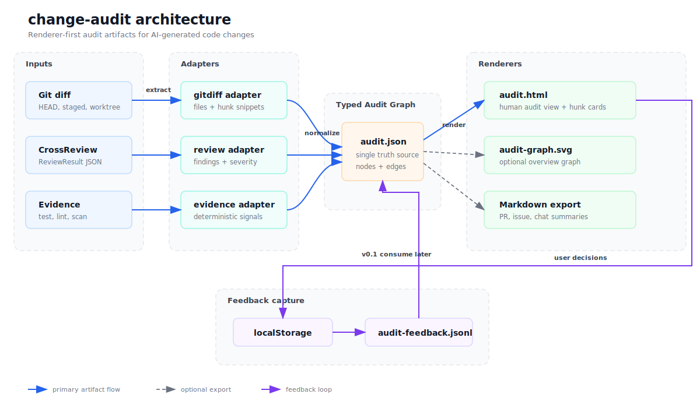

# Schema、审查与 renderer 架构

PNG 版本：[`change-audit-architecture.png`](../../../../../docs/assets/change-audit-architecture.png)

关键边界：

- 图只描述一期 `code_diff` profile；长期 review 内核是 artifact-general，正式 audit 按 profile 四项门禁放行。
- `.run/` 位于最终目录同父目录的隐藏 staging workspace；提交前最终目录不存在。
- 宿主 LLM 只生成语义候选；Python 生成 ID、edge、fingerprint、可信 hunk、状态和评分。
- finalize 在 staging 中生成候选 `audit.json`，renderer 只消费该完整 JSON 并生成候选 `audit.html`。
- JSON Schema、引用、锚点、状态、XSS、`data-*` 回链和 run/graph identity 全部通过后，才复查目标 leaf，并在本地 single-writer 前提下用一次同文件系统目录 rename 成对发布。
- `run_id` 防止跨进程材料串包；POSIX 权限为 best-effort。原生 no-replace、对抗性竞态和递归符号链接防御不进入一期门禁。
- 独立 `render` 仍是纯消费入口，只负责单个 HTML 的原子替换，不承担 finalize 的产物对提交。
- Wave 1 只做 renderer checkpoint；三类 Wave 2 dogfood 通过后才冻结 schema `0.2`。
