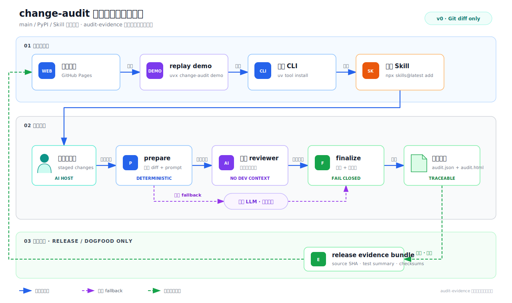

# 技术设计：change-audit 零摩擦分发与审计证据隔离

## 权威决策

- [ADR-001](adr/001-pypi-cli-standard-skill.md)：PyPI CLI 是 runtime 与版本真相源，Skill 是静态薄编排层。
- [ADR-002](adr/002-keep-change-audit-identity.md)：Alpha 保留 `change-audit`；v0 只实现 Git diff profile。
- [ADR-003](adr/003-main-and-audit-evidence-placement.md)：main 是产品面，`audit-evidence` 是维护与证据面；首次 Alpha 前完成隔离，evidence 失败即阻断发布。

## 仓库结构

```text
main                                      audit-evidence (orphan branch)
├── change_audit/                         ├── .sopify/
├── skills/change-audit/                  ├── evidence/releases/
├── tests/                                └── docs/              # Pages
├── docs/              # 用户/集成文档
├── README.md
├── pyproject.toml
└── .github/workflows/
```

| 去向 | 内容 | 验收契约 |
|---|---|---|
| `main` | 源码、schema、测试源码、小 fixture、Skill、用户文档、CI/publish workflow | release tag 单独 checkout 可构建并跑测试 |
| `audit-evidence/.sopify` | project、blueprint、活动 plan、history、精简 receipts | state/user 不提交 |
| `audit-evidence/evidence/releases` | audit、测试摘要、manifest、checksums | 按 release/source SHA 追加，不重写 |
| `audit-evidence/docs` | Pages 首页、报告和证据索引 | 公开展示，不是产品版本源 |
| 本地/CI 临时 | raw output、coverage、完整日志、截图、build/dist | 默认不永久提交 |

evidence branch 不包含产品源码、不合并回 main，也不维护第二个产品版本。

## 固定 worktree 契约

1. `audit-evidence` 使用独立固定 worktree；本地路径不写入仓库。
2. main checkout 的 `.sopify` 是被忽略的本地 symlink，指向 evidence worktree 中的 `.sopify/`。
3. bootstrap 文档必须覆盖全新机器的 fetch、worktree、symlink、验证、恢复与移除命令。
4. `.sopify` 可以演进；`evidence/releases/` 一经发布只追加、不重写。
5. 普通产品用户和 main CI 完全不依赖该 worktree。

## Release evidence bundle

```text
evidence/releases/v0.1.0a0/<source-sha>/
├── manifest.json
├── audit.json
├── audit.html
├── test-summary.json
└── checksums.sha256
```

manifest 记录 repository、`source_commit`、release tag、package/schema/prompt version、audit status、脱敏结果和文件 hashes。README 链接稳定 Pages/分支入口；Release 在 evidence push 后链接确切 evidence commit。

## 用户链路



1. GitHub Pages 提供零安装预览。
2. `uvx change-audit demo` 运行离线合成 replay，并显著标记 provenance。
3. `uv tool install change-audit` 安装 CLI；`npx skills@latest add evidentloop/change-audit --skill change-audit -g` 安装 Skill。
4. Skill 编排 `prepare -> isolated review -> finalize`，返回正式报告；无兼容宿主时保留人工 `prepare -> external review -> finalize` 通道。

## Runtime 契约

- `change-audit doctor [--json]`：检查 package/schema/prompt/resources/Git；`npx` 缺失只做非阻断提示。
- `change-audit demo [--out DIR]`：运行冻结 replay，不冒充实时审查。
- `prepare`、`finalize`、`render` 保持现有结构化 stdout、fail-closed 和原子写入契约。
- `python -m change_audit` 与 console script 调用同一 `main()`。
- Skill 不复制 Python 业务逻辑；CLI/schema/prompt 不兼容时在 `prepare` 前停止。

完整真实审计要求宿主能发现 Skill、精确读写文件并创建不携带开发上下文、shell、密钥和写权限的隔离 reviewer。只有完成真实 E2E 的宿主才能标为“已验证”。

## 发布不变量

1. main 候选 commit 必须在无 evidence worktree 时独立通过 build/test/install。
2. evidence bundle 必须针对该候选 commit 重新生成，并通过脱敏、status 与 checksums 校验。
3. main/evidence 远端 SHA 与 manifest 一致后，才允许创建 tag 和发布 PyPI；任一步失败都 fail closed。
4. Pages 从 `audit-evidence/docs` 发布；Release 链接确切 evidence commit。

publish workflow 只授予 `contents: read` 与 `id-token: write`，绑定准确 repository、workflow 与受保护 environment。具体执行顺序只在 `tasks.md` 维护。

## 安全边界

- 安装步骤透明；Skill 不自动安装/升级 CLI，也不修改被审计代码。
- diff、文件名、源码和 LLM 输出始终视为不可信数据。
- evidence push 前必须脱敏；本地绝对路径、密钥、raw model output 与用户状态不得进入公开分支。
- demo、人工集成与真实宿主审查必须在 provenance 和用户文案中可区分。
