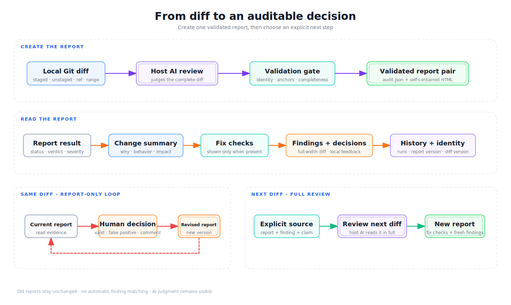

<h1 align="center">EvidentLoop</h1>

<p align="center"><strong>Turn local Git diffs into evidence-backed, traceable audit reports.</strong></p>

<p align="center">
  <a href="https://github.com/evidentloop/evidentloop/blob/main/README.md">English</a> ·
  <a href="https://github.com/evidentloop/evidentloop/blob/main/README.zh-CN.md">简体中文</a>
</p>

<p align="center">
  
  
  
</p>

EvidentLoop turns a local Git diff into a validated JSON/HTML audit pair. Findings are anchored to real changed lines; human decisions can revise the report without changing code, and a later diff can explicitly verify a selected old finding without rewriting history.

The host AI makes the judgment. EvidentLoop validates identities, changed-line anchors, completion, and artifact consistency. It is an audit trail, not a formal proof system.

## Quick start

Requirements: Git, Python 3.10 or newer, uv, Node.js/npx for Skill installation, and a coding agent with Skill support.

```bash
# Try the bundled offline demo
uvx evidentloop demo

# Install the CLI and Skill
uv tool install evidentloop
npx skills@latest add evidentloop/evidentloop --skill evidentloop -g
evidentloop doctor
```

`pipx install evidentloop` is the CLI fallback.

Inside the Git repository to inspect, ask your coding agent:

```text
Use EvidentLoop to audit my staged changes and generate the HTML report.
```

## Report demo and real dogfood evidence

<picture>
  <source media="(prefers-reduced-motion: reduce)" srcset="docs/assets/evidentloop-report-loop.png">
  
</picture>

The animation uses a representative schema `0.5` report generated by the current renderer to show a finding, full-width diff, and local decision. The separate [self-audit report](https://evidentloop.github.io/evidentloop/examples/evidentloop-dogfood-v05/audit.html) covers 43/43 files and ends `complete / pass_candidate` with 0 findings. It proves report generation, validation, and rendering for that range. The public evidence does not yet include a real two-diff fix-verification run.

## How it works



- **Review a complete diff.** The host AI returns its judgment; EvidentLoop validates the result and renders one self-contained report.
- **Revise the report, not the code.** Same-diff feedback updates only the JSON/HTML report pair without invoking model review.
- **Verify a later diff explicitly.** A source report, chosen finding, and claim start a new full-diff review. Old reports remain unchanged and EvidentLoop does not guess finding matches.

The Alpha report UI and AI review text currently use Simplified Chinese.

## Output

| File | Purpose |
|---|---|
| `audit.json` | Validated audit record linking Git changes, findings, decisions, and report lineage. |
| `audit.html` | Self-contained report showing the result, relevant diff, and browser-local decisions. |
| `audit-feedback.jsonl` | Optional machine-readable decision export for a coding agent. |

Pending feedback stays in each viewer's browser until copied or downloaded. The HTML can be shared after redaction, but it is not a multi-user review service.

## Alpha scope

| Supported | Not supported |
|---|---|
| Local Git staged, unstaged, ref, and range diffs | Folder diffs, file-only review, or remote PR URLs |
| Added, modified, deleted, renamed, and binary-file metadata | Automatic fixes or command execution |
| Schema `0.5`, exact changed-line evidence, and same-diff report revision | Automatic model re-review from feedback |
| Explicit next-diff verification from a source report, finding, and claim | Automatic finding matching or inferred repair from disappearance |
| Complete, partial, failed, and inconclusive states | Silent stale-feedback merging or cross-workspace report search |

## Integration and development

Use EvidentLoop through the Skill as a standalone product; no other workflow is required. Integrators can follow the `prepare -> external review -> finalize` path in [AI host integration](docs/ai-host-integration.md), use the public API in `evidentloop.api`, and rely on `diff_version` plus `report_version` for artifact identity.

For local development:

```bash
python -m pip install -e '.[dev]'
python -m pytest -q
python -m ruff check .
python -m build
```

References: [Pages](https://evidentloop.github.io/evidentloop/) · [V0 scope](docs/v0-scope.md) · [Data model](docs/data-model.md) · [AI host integration](docs/ai-host-integration.md)

Alpha feedback and bug reports are welcome in [GitHub Issues](https://github.com/evidentloop/evidentloop/issues).

## License

Licensed under the [MIT License](LICENSE).
