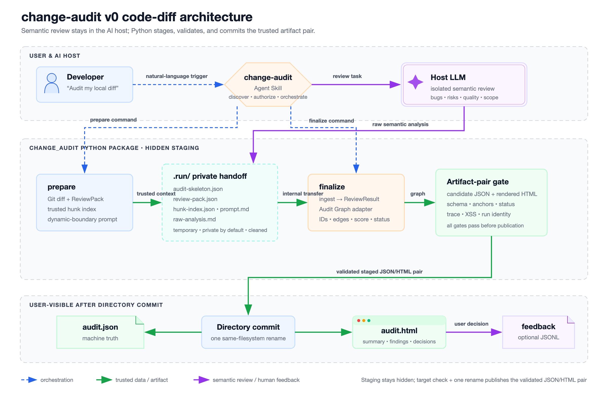

# change-audit

面向 AI 变更与可审查产物的可回链审计工具。

[English](README.md)

`change-audit` 由 artifact-general 隔离审查内核和按类型成熟度开放的审计 profile 组成。一期首个正式 profile 把本地 Git diff、宿主 LLM 的语义审查和用户决策收口为两个核心产物：

- `audit.json`：机器可读、可校验的审计真相源。
- `audit.html`：带代码上下文、证据关系和决策控件的自包含报告。

```text
用户自然语言请求
  -> AI host Skill
  -> prepare -> host LLM -> finalize
  -> 在 staging 中生成并校验 audit.json + audit.html
  -> 成对提交正式产物
  -> 可选 audit-feedback.jsonl
```



## 当前状态

方案、数据模型和目标 HTML 已定义；实现代码尚未开始。当前活动方案只完成文档收口，不迁移 CrossReview 代码。

## 一期交付形态

一期是“一个 Python 包 + 一个 Agent Skill”：

- Python 包拥有 Git diff 解析、CrossReview 内部审查子系统、Audit Graph adapter、校验和 renderer。
- Skill 负责自然语言发现、安装授权、调用宿主 LLM、失败处理和报告展示。
- 默认路径不在 Python 中调用模型 SDK，也不管理 API key。
- 用户项目不需要复制 `CHANGE_AUDIT_AI.md` 或其他集成文件。

用户只需对 AI host 说：

```text
帮我用 change-audit 审计最近的本地改动
```

Python 包暴露三个模块入口。Skill 正常主链只调用 `prepare` 和 `finalize`；`finalize` 会自动渲染，`render` 是独立重渲染入口：

```bash
python -m change_audit prepare --diff HEAD~1
python -m change_audit finalize --out audit/20260710_example/
python -m change_audit render audit/20260710_example/audit.json --out audit/20260710_example/audit.html
```

`review` 是 Skill 的用户动作，不是 Python 命令。

独立重渲染时，显式 `--out` 只授权原子替换该 HTML；校验失败会保留旧 HTML，且永不修改 `audit.json`。

## 产物

默认目录：

```text
audit/YYYYMMDD_<slug>/
  audit.json
  audit.html
  .run/                    # 仅显式保留审查材料时存在
```

运行期间，prepare 使用 `audit/.<slug>.change-audit-staging/` 这类同父目录隐藏 workspace。JSON/HTML 全部通过后，finalize 会复查最终目标 leaf 不存在，再用一次同文件系统目录 rename 提交；目标已存在或 rename 失败时停止并保留 staging 诊断，不主动删除或覆盖目标。V0 按本地单写者、非对抗并发设计，不承诺原生 race-proof no-replace；POSIX 0700/0600 只是 best-effort 隐私设置，不是跨平台门禁。

用户在 HTML 中主动导出后可获得 `audit-feedback.jsonl`。浏览器下载位置不保证等于审计目录。

| 产物 | 用户是否默认看到 | 作用 |
|---|---|---|
| `audit.json` | 是 | 审计图谱真相源 |
| `audit.html` | 是 | 人类审计与决策界面 |
| `audit-feedback.jsonl` | 否，用户导出后产生 | 用户对 finding 的判断 |
| `.run/` | 否 | ReviewPack、prompt、raw analysis 等内部材料；仅显式保留时进入最终目录 |

ReviewPack、ReviewResult 和 CrossReview 名称不会成为用户必须理解的产品接口。

## Artifact profiles

内部 `change_audit.review` 可以逐步扩展到 plan、design、analysis、review-result 和 agent output 等可审查产物。一个类型只有具备 adapter、可信 anchor、eval baseline 和 renderer profile 后，才成为正式 audit profile。

四项门禁未齐备时，实验性非 diff 类型可以产生内部 ReviewResult 或宿主摘要，但不能宣称已支持 `audit.json` / `audit.html`。`0.2` 是 code-diff audit profile，不是所有 artifact 的通用 schema。

## 审查能力

一期 finding 主要来自 AI host 的 LLM 语义审查，可以发现逻辑 bug、安全风险、遗漏边界、测试缺口和质量问题。

Python 负责防止审查结果漂移：

- 文件、行号和 hunk 必须回到 prepare 阶段解析出的真实 diff。
- LLM 不生成 node ID、edge、fingerprint 或风险评分。
- 无法精确定位的语义 bug 不会被静默丢弃，而是降级为未计分 risk。
- 未审查、完整、部分和失败状态彼此独立，不用“零 finding”猜测执行状态。

## 目标 HTML

v0 目标 HTML 形态——设计参考，尚未由 renderer 生成。


页面按用户问题组织：

1. 本轮是否完成审查，结论是什么。
2. 改了哪些文件，摘要是否可靠。
3. 有哪些 bug、risk、quality 或 scope finding。
4. 每条 finding 对应哪个真实 hunk、证据和修复建议。
5. 用户如何确认、标记误报、评论或调整严重度。

完整审查且无未解决 finding 时，不渲染空的问题模块；fixed 历史记录仍可展示。审查失败或不完整时不会显示成“干净”。

## 不做什么

一期不做：

- Python 默认路径直接调用 LLM SDK 或管理 API key。
- 自动修改代码或执行审查文本建议的命令。
- folder diff、无 diff 文件审查和远程 PR URL。
- 反馈消费、Hosted dashboard、policy enforcement。
- 产品 SVG renderer 或 Markdown renderer。
- PyPI 发布和正式 `change-audit` console-script。

这些是一期边界，不是项目蓝图的永久排除项。仓库里的架构 SVG/PNG 是设计文档资产，不代表一期产品提供 SVG 报告。

## 文档

- [v0 范围](docs/v0-scope.md)
- [数据模型](docs/data-model.md)
- [AI host 集成](docs/ai-host-integration.md)
- [Hunk context 主样张](docs/examples/hunk-context-demo/)
- [当前方案](.sopify/plan/20260710_audit_json_v0_schema_renderer_spike/plan.md)

## 项目关系

- CrossReview：其审查核心计划等价迁入 `change_audit.review`；旧仓库暂时保留作为迁移基线。
- [sopify](https://github.com/evidentloop/sopify)：可选工作流与 checkpoint 编排。
- [tech-report](https://github.com/sateful-ai/tech-report)：可消费 `audit.json` 的叙事型报告工具。

## License

MIT
